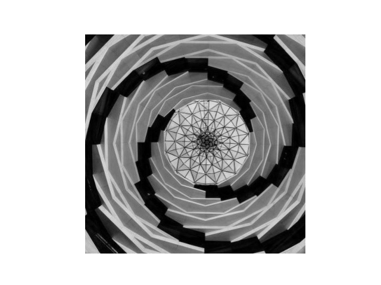
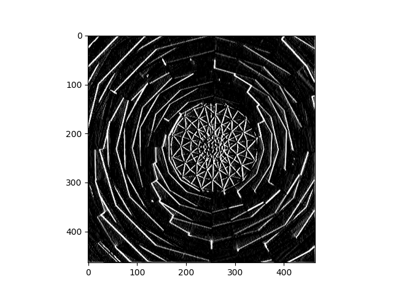
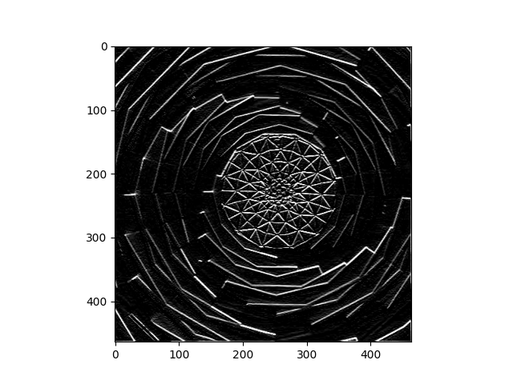
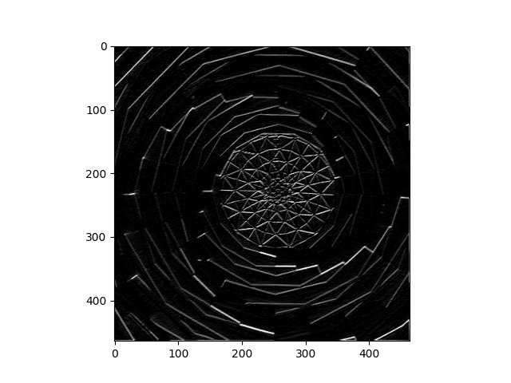
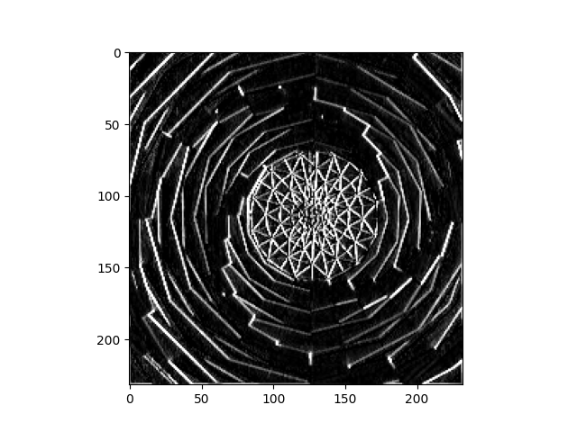

Original image: 

I found this cool image on the architecture section of unsplash. I wanted to see what the vertical and horizontal line filters could do with it since it has so many lines that are going in a circle. I modififed the horizontal and vertical line filters slightly, just adding bigger numbers to see what that would do.

Filter 1 = [ [-2, -3, -2], [0, 0, 0], [2, 3, 2]]

The result was about the same as the original vertical line filter. The only difference is that the whites were accented more with the filter with slightly bigger numbers

Filter 1 image:

Filter 2 I did the same, using larger numbers instead of the original, but keeping the design of the filter the same

Filter 2 = [ [-2, 0, 2], [-3, 0, 3], [-2, 0, 2]]

Filter 2 image: 

For filter 3 I tried to see if I could get a diagonal line filter in some way. I did this by creating a diagonal line of zeroes in the 3X3 array. It seemed to work

Filter 3 = [[0,-1,1],[-1,0,1],[-1,1,0]]

Filter 3 image: 

The convolution is going through each pixel in the image (for x/y in range(size_x/y-1). In the actual loop, it is going through a 3X3 array one at time, applying the filter that is a 3x3 array from one corner to the other, 9 times to get every pixel. This ends up emphasizing the lines that are emphasized by the filter. For the vertical, the zeroes end up being in the middle row of the 3x3 array that is the filter. Therefore, in the final image, that middle line is not seen as much, and the vertical lines are emphasized much more. This is super useful for computer vision because it allows for the features of an image to pop out way more. This means that the patterns are much easier to recognize for the computer, making it much easier to recognize objects

Pooling:
I pooled the vertical line image:

