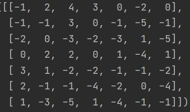
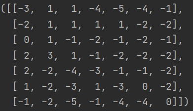

Convolving the two matrices

The two filters I was given were:
filter1 = [[0, 1, 0], [1, 0, 1], [1, 1, 0]] and filter2 = [[0, 0, 1],[0, 0, 1],[1, 1, 1]]

I convolved the filters around the matrix using the original loop that we used for the images. The big change I had to make was getting rid of the If statement that made 
all the numbers under 0 equal to 0. Especially since my matrix had many negative numbers. 

This was my output for filter 1:

and this was my output for filter 2:

Since I was inputting i_transformed as a 9x9 array, I was pretty sure that it wasn't going to magically going to be a 7x7. However, when I looked at the data it was very
clear that there was a square inside of the 9x9 that had actually been convolved. In order to get the 7x7, I just got ride of the rows and columns that had not been convolved 
around and ended up with a 7x7. 

Question 1- The purpose of having the 3x3 filter convolve throught the 2 dimensional image is that it extracts the features that are specified in the filter. Extracting these 
features and essentially emphasizing them makes it much easier for the computer to recognize patters and learn how to recognize different objects. 

Question 2- Using more than one featrure is important to be able to extract different types of features. Extracting different features from the same image is essential in order to
give the computer enought to work with when it is trying to learn and recognize objects in images. In the fasion mnist, there were 500 dense layers that wittled down the pictures
and 10 dense layers at the end that compared what the model gave it to an image of the target feature. 

MSE for the Homes:

10 biggest over-predictions MSE = 618.038
10 biggest under-predictions MSE = 26008.94
10 most accurate predictions MSE = 0.276

Overall, the model seemed to lean to under predict more than over-predict. Also, probably because of the lack of variables, the model pretty much predicted around 230-270 thousand for most houses> I thought this was a little strange, so I am going to have to go back and look at the code to see if there is something I missed. I will do that this weekend though because I have had quite a long week. The most significant predictor seemed to be number of baths.

