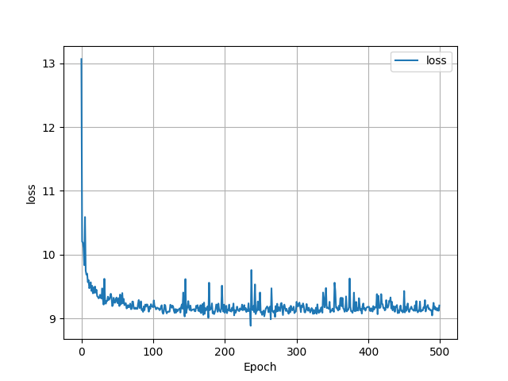
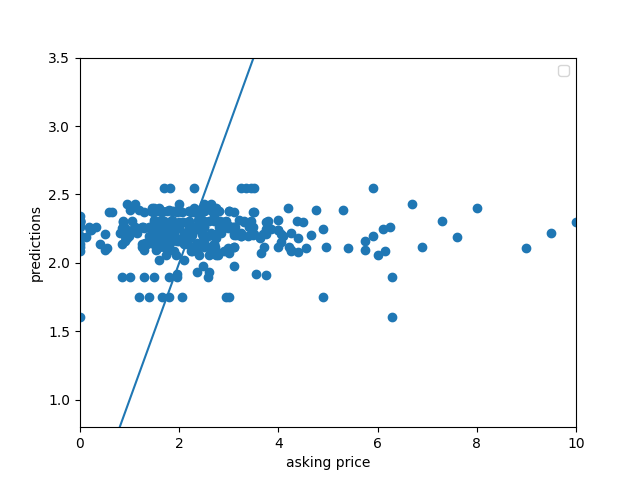
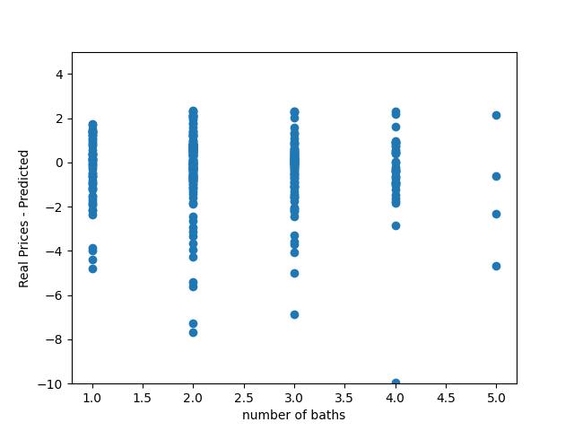

Data 310: Project 1 Write Up

Housing Data Description

I ended up choosing Baltimore as the city that I analyzed. I scraped 400 homes from the website and about 360 of those homes were useable.
This was mostly due to the fact that many of them were missing square feet values. In total I had to cut off 40 homes, leaving me with 10% less of the data.
Because of this, I think that the model lost a lot of predictive power. The majority of the home prices were in the 200-300 thousand range, and because of that 
the model predicted for most homes to be in the range of 200 to 300 thousand in price. I think because of the nature of the data, it meant that the loss of the 
model never really improved throughout the epochs and was a little random at times. Because of this I really tried to incorporate the zipcodes as a variable in
the model, but I did not have too much success. I'll go into how I tried to incorporate it later. All in all though, scraping many more homes probably would have 
been very beneficial to the predictive power of the model. Also, the data for the three variables at a glance did not seem to be predictive of the actual price 
consistently at all. 

Model Architecture

The model architecture was relatively simple. I made the 3 variables into arrays and then used the stack function like the code that the professor showed us. 
This stack function is where I ran into trouble with the zipcodes. Since the zip codes are categorical data, I had to look up ways for neural networks to handle 
that. I found articles talking about OneHotEncoder, a preprocessing tool from sklearn that turns categorical data into 1's and zero's. The problem came when I 
tried to pair this encoded data with the other 3 variables, they were not the same shape so the stack line did not run. I tried to reshape the matrix returned 
from OHE to be one-dimensional, but it still did not work. I would be interested in working with the professor to see if we could get the model to work with the
zip codes. The dense layers were pretty simple, only one dense layer with an input shape of 3 for the three different variables. Then the model was compiled using 
'sgd' as the optimizer and MSE as the loss. Like I said, the epochs had pretty random loss's, and never really improved. I think this mostly has to do with the lack
of variables and small size of the data set. 

Output analysis

The predictions of my particular model ranged mostly from 200 to 290 thousand at the higher end. It seems like a spatial variable would really add to the predictive power,
mostly because most of the data was around this price range. I think maybe cutting out some of the outliers that had really high or low prices would have helped, but I had 
already cut out so much of the data that I did not think it would be a good idea. However, since the data was pretty homogenous and all around 200 thousand, the model did 
have some pretty solid predictive power in that range, predicting almost 30 homes within 10 thousand of the actual price, and a good amount of the predictions being within 
50k over or under the actual price. The best deals are the houses that were must over predicted, but still had a relatively listed price (in order to account for the outlying 
data). 

This first graph visualizies how the loss changed over time using a histogram

The second graph shows the predicted vs the actual prices, with the line running through the middle representing the 1 to 1 correct answers. Most of the data accumulated around
the line, with a few outliers of extremely high priced houses to the right not being close at all. This graph shows that a good amount of the data was over-predicted, but not by
too much.

This last graph shows number of baths compared to the difference between the real price and the predicted price. For some reason baths seemed to be the most predictive factor, and that is shown here.  When baths were one or two, the model seemed to be pretty accurate at predicting prices. 

All in all, I'm not super satisfied with how the model performed. I spent a lot of time trying to incoprporate the spatial variable, but didn't have success incorporating it. 
However, the model did decently despite that and managed to predict a good amount of the prices somewhat accurately. 
