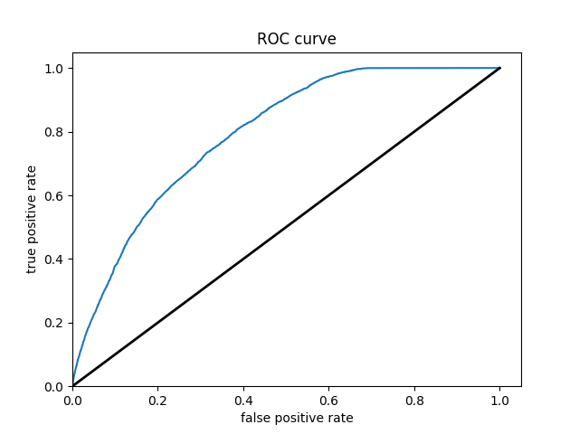
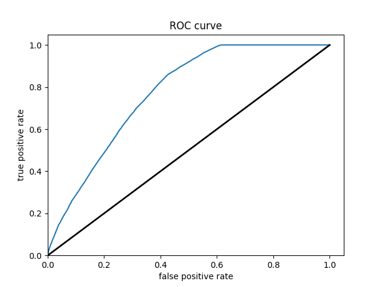

For my project I chose Colombia. I initially wanted to do the project on Venezuela but the DHS does not conduct surveys there. There were about 44,000 housholds worth of
data, with around 162,000 individual persons.

PENALIZED REGRESSION MODEL

Question #1 - Which "top_model" performed the best?

For the 15 slices taken, the mean AUC ranged from 0.633 to 0.621. The first five slices had an AUC of of 0.633, making them the best peforming models. However, model 5 did not have a very large penalization. I ended up choosing model 12 at an AUC of 0.628 and a penalization of 0.00137 as the best model. 

Question #2 -  Are you able to use the feature selection penalty to tune your hyperparameter and remove any potentially irrelevant predictors?

Yes, I was a little confused on which was more important in the models; more penalization or higher (slightly) AUC scores. I talked to professor Frazier and he explained that 
a small difference in AUC score is irrelevant if the model is more penalized than the previous ones. After this discussion, I ended up choosing model 12 as my best one. This model had a penalization of 0.00137 and an AUC score of 0.628, which compared to the highest 5 (.633) is not much of a difference at all. The reason I chose this model was because model 13 jumped down to 0.626 and the subsquent models got continually worse. On the other hand, model 11's AUC score was only .001 higher, making model 12 the best in between.

Question 3 - Provide your ROC plots and interpret them. How effective is your penalized logistic regression model at predicting each of the five wealth outcomes.

The model is very effective at predicting the 1st and 5th wealth outcomes. This is to be expected, because the two extremes are the easiest to differentiate. I was surprised to 
find that wealth classification number 1 was the second largest subset of the data (27% of the data). I imagine that the model found patterns in specific predictors like age or size of household that helped differentiate class 1 regardless of its size. I think that the the model did struggle with the size of wealth class 2 (28% of all data).This is where the model performed the worst, and I imagine that there were a great range of values for the predictors in this wealth class. This would make it extremely difficult for the model to find any patterns and have any predictive power. The same goes for class 3. I imagine that class 5 has discernable patterns in its predictor values that helped the model clearly differentiate this class from the other 4. 

RANDOM FOREST

Question #1 - How did your random forest model fare when compared to the penalized logistic regression?

The random forest models performed slightly better than the penalized regression model, with an average AUC score of 0.646. The plot below shows the logistic regression AUC graphs compared to the random forest ones, and you can see that the random forest curves are slightly larger. 

Question #2 - Provide your ROC plots and interpret them. Are you able to provide a plot that supports the relative importance of each feature's contribution towards the predictive power of your random forest ensemble model?

This models result is pretty similar to the logistic regression. The AUC scores were slightly higher, a difference of 0.013. One thing that I found super interesting about the two AUC graphs was how the curves looked. The LR graph had irregular divets in the curve in some of graphs. However, the random forest AUC curves were very smooth and did not change much at all. I think these differences in the curves are what ended up giving the random forest the slight edge. I don't really know how to explain this difference, but I imagine it has something to do with the nature of the two different models. 

Also, here is a graph that shows the relative "importance" of the individual factors in the random forest model. Age seems to be the most powerful predictor. 

LOGISTIC REGRESSION

The first thing we do here is individually go through the 5 wealth classes and predict them. This is helpful for the model because, instead of trying to differentiate all of them, it is just trying to figure out if they are the individual class that is being studied at the time. I got some pretty good results. All of the models did not dip below .70 accuracy, and the predictions of classes 1 4 and 5 all had accuracy scores in the 80's, which I'd say is pretty solid with how simple of a model this and that its real data.

Here are the ROC curves for all of the individual wealth classes being predicted by all of the features 

WEALTH CLASS 1

WEALTH CLASS 2

WEALTH CLASS 3

WEALTH CLASS 4

WEALTH CLASS 5

Since we saw in the last model that age and aducation are the most powerful predictors, I chose those as the columns to derive. Since all of the models have also struggled with class 2, I chose that one as the one to study. There was actually a very slight improvement for me! For class 2, all of the features had an accuracy of 0.7170, and the derived columns had an accuracy of 0.7175. Not a big difference at all, but cool to see that there was some very slight improvement. I am honestly surprised that the accuracy did not go up more. Here is the ROC curve with the new derived columns

BOOSTED TREES

Wealth Class 1 

Wealth Class 2 

Wealth Class 3 

Wealth Class 4 

Wealth Class 5 

Of all of the models, the Boosted Decision Trees model was the most effective at predicting wealth outcomes. The average AUC of all of the boosted trees models was 0.7232, making it by far the highest AUC average. I dont know why, but some of the boosted trees AUC curves had a weird slant to them, but it did not seem to affect the models efficiency. Even with how simple this model is, it is very cool to see how solid of a model we can work with. It's still not great, only being on a verage 0.7232, but with how little tuning and messing with hyperparameters we did, it is pretty impressive. I really liked this project because of the practicality of the data. I've never worked with such "real" data in college. I look forward to possibly coming back to these models in the future and improving them even more!
