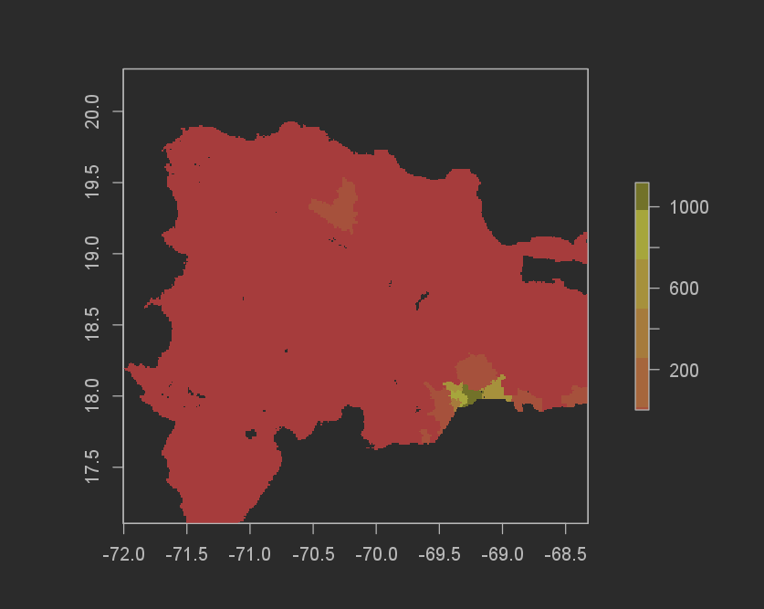
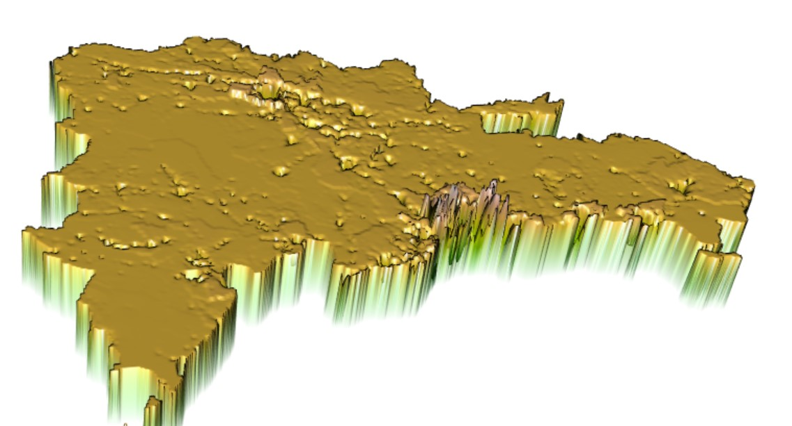

I used the linear regression and random forest models to predict population values at 100X100 meter grid cells in my chosen country. I ended up having to change my chosen country because of the size of the vector file of Colombia, my original country. Because it was too large, I ended up staying in the area and chose the Dominican Republic as my country due to the much smaller size. Here, I was actually able to develop some pretty solid results for the two models using the dasymetric allocation. Here are some graphs and numbers to visualize how these models did. 

LINEAR REGRESSION MODEL

First, the difference in between the predicted populations sum and the real number was pretty close for this for how simple of a model it is. It overpredicted by 622,458 (12,073,435[actual pop] - 12,080,977[predicted pop]). For the margins that we are working in, half a million is not that bad considering the simplicity of the model. The difference in sums was also pretty solid, with the error ranging from -146 to 84. Here are some graphs to help visualize the results.

Population Sums plot
 

Population sums frequency

Difference of Sums plot

Difference of sums frequency

3D Predicted Values

`
MSE

Random Forest Model

The difference in total sums for the random forest model was even better than the Linear regression model. The Random forest model underpredicted by 551,321 (12,624,756[actual pop] - 12,080,977[predicted pop]). I don't think it matters if the prediction is over or under, and because of this the absolute value means that the Random forest model performed better! The MSE graph also helps to show this. 

Population Sums plot
 

Population sums frequency

Difference of Sums plot

Difference of sums frequency

3D Predicted Values

`
MSE

Discussion

All in all, these models are relatively succesful considering that they are not that complicated. The models struggled the most with the cities because humans have developed tall buildings to house as many people as possible in the small areas that cities are. Because of this, the model would probably work much better with a LIDAR layer considering building heights. I also would have liked to do more with the visualizations of the data for these models. I feel like I would have done a much better job if I could use ARCGIS pro, but I did not want to go through the hassle of getting these files on there. I changed the color palettes and tried to create breaks that would better symbolize the data, but the program did not seem to like me and would end up doing random things like making one of the colors black instead of the red that it was supposed to be. I also wanted to switch around the orientation of the colors, but after looking at the documentation for the raster package it seemed that there wasn't a command to do that. All in all though, it was a really cool project that incorporated a lot of the knowledge that I have gained throughout my work in GIS and coding courses.
